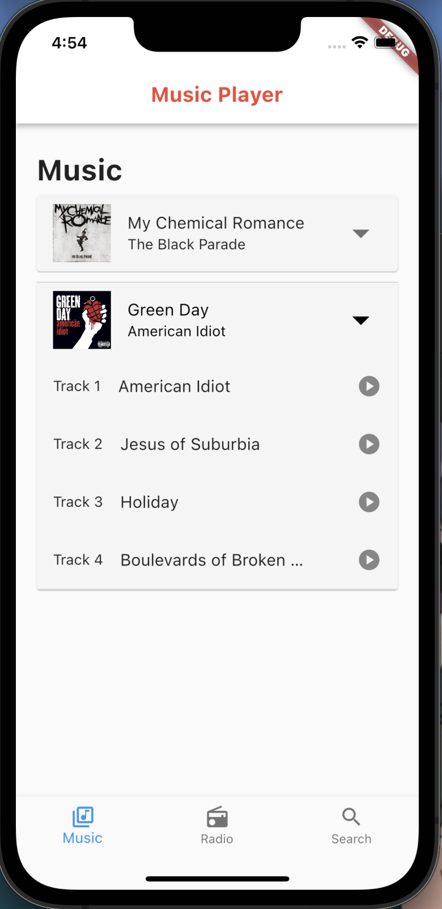
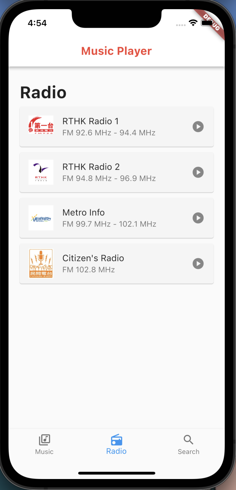
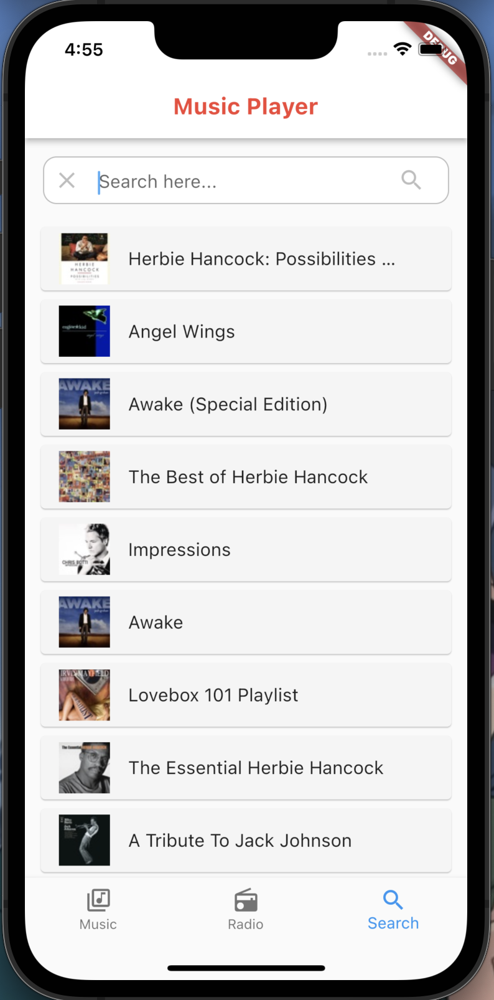

# Flutter app

My first flutter project

## Description

This project is my first foray into flutter.

It is a part of an 2.5 week interview assignment to develop a simple apple music clone with 3 tabs:
1) Music

2) Radio

3) Search function which queries the itunes API for searching music.

